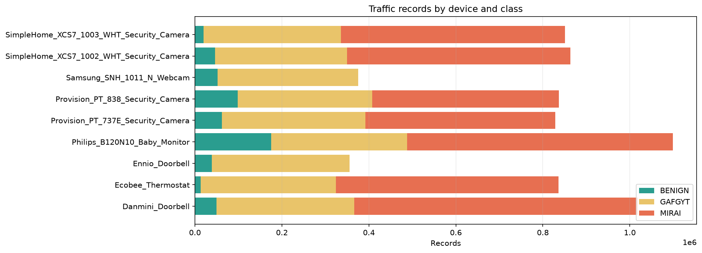
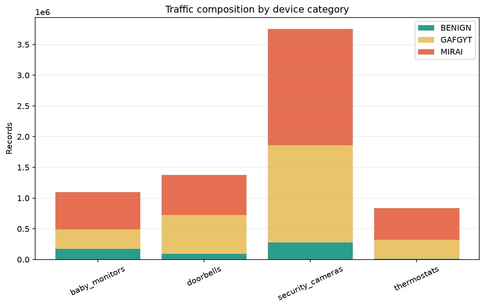
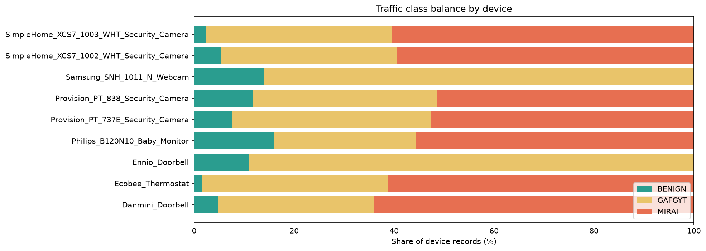
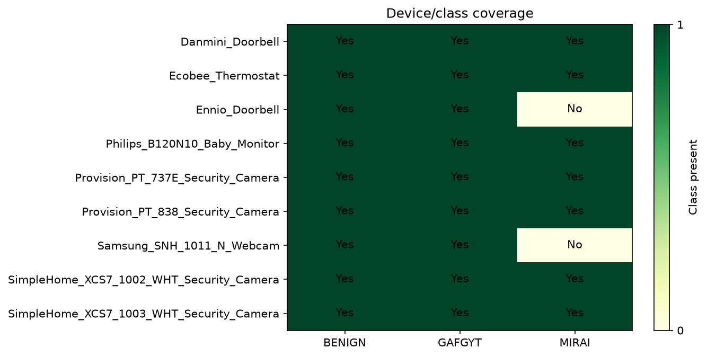
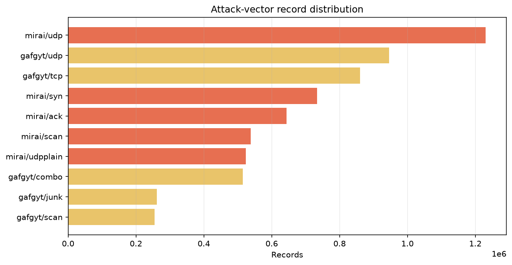
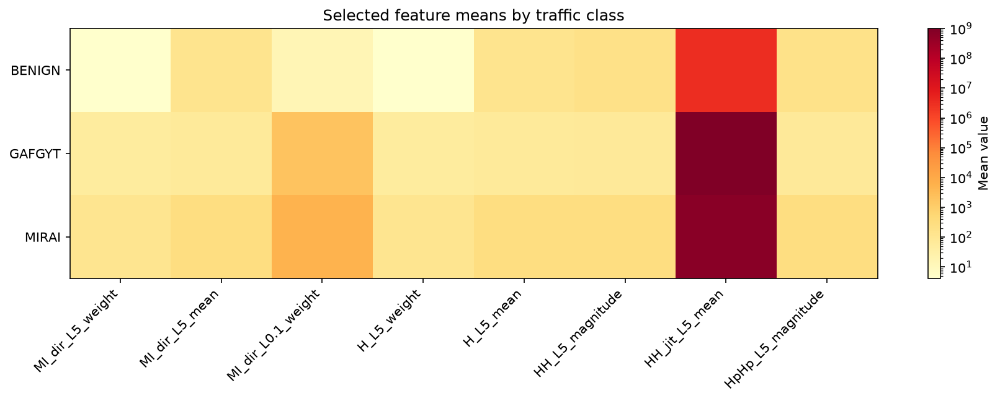
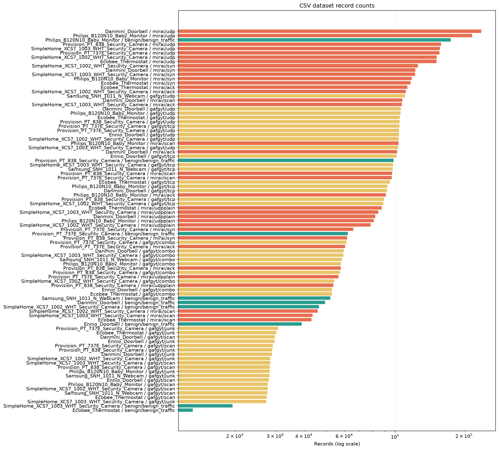

# N-BaIoT Dataset Exploratory Data Analysis (EDA) Report

**Generated**: Automated Streaming Analysis Engine
**Total Execution Time**: 127.81 seconds
**Total CSV Datasets**: 89 files
**Total Network Traffic Records**: 7,062,606 packets
**Total Dataset Storage Volume**: 7.58 GB (7,763.8 MB)
**Feature Schema**: 115 columns in every dataset
**Dataset Completeness**: 100.00% (0 missing/null cells)

---

## 1. Executive Summary & Taxonomy

The dataset contains **9 IoT devices** across **4 device categories** and **89 CSV datasets**. It contains benign traffic plus two botnet families: **Mirai** and **BASHLITE / GAFGYT**.

| Traffic Class | Records | Share of Records |
|---|---:|---:|
| **BENIGN** | 555,932 | 7.87% |
| **GAFGYT** | 2,838,272 | 40.19% |
| **MIRAI** | 3,668,402 | 51.94% |

---

## 2. Summary by Device Category

| Category | Devices | CSVs | Records | Size (MB) | Benign | GAFGYT | Mirai |
|---|---:|---:|---:|---:|---:|---:|---:|
| `baby_monitors` | 1 | 11 | 1,098,677 | 1,244.8 | 175,240 | 312,723 | 610,714 |
| `doorbells` | 2 | 17 | 1,373,798 | 1,461.3 | 88,648 | 633,050 | 652,100 |
| `security_cameras` | 5 | 50 | 3,754,255 | 4,088.5 | 278,931 | 1,581,869 | 1,893,455 |
| `thermostats` | 1 | 11 | 835,876 | 969.1 | 13,113 | 310,630 | 512,133 |

---

## 3. Device Coverage and Class Balance

A missing class/device combination can affect how well a model generalizes beyond the observed devices.

| Device | Category | CSVs | Benign | GAFGYT | Mirai | Total Records |
|---|---|---:|---:|---:|---:|---:|
| **Danmini_Doorbell** | `doorbells` | 11 | 49,548 | 316,650 | 652,100 | **1,018,298** |
| **Ecobee_Thermostat** | `thermostats` | 11 | 13,113 | 310,630 | 512,133 | **835,876** |
| **Ennio_Doorbell** | `doorbells` | 6 | 39,100 | 316,400 | 0 | **355,500** |
| **Philips_B120N10_Baby_Monitor** | `baby_monitors` | 11 | 175,240 | 312,723 | 610,714 | **1,098,677** |
| **Provision_PT_737E_Security_Camera** | `security_cameras` | 11 | 62,154 | 330,096 | 436,010 | **828,260** |
| **Provision_PT_838_Security_Camera** | `security_cameras` | 11 | 98,514 | 309,040 | 429,337 | **836,891** |
| **Samsung_SNH_1011_N_Webcam** | `security_cameras` | 6 | 52,150 | 323,072 | 0 | **375,222** |
| **SimpleHome_XCS7_1002_WHT_Security_Camera** | `security_cameras` | 11 | 46,585 | 303,223 | 513,248 | **863,056** |
| **SimpleHome_XCS7_1003_WHT_Security_Camera** | `security_cameras` | 11 | 19,528 | 316,438 | 514,860 | **850,826** |

### Device/Class Coverage Matrix

| Device | Benign | GAFGYT | Mirai |
|---|---:|---:|---:|
| Danmini_Doorbell | Yes | Yes | Yes |
| Ecobee_Thermostat | Yes | Yes | Yes |
| Ennio_Doorbell | Yes | Yes | No |
| Philips_B120N10_Baby_Monitor | Yes | Yes | Yes |
| Provision_PT_737E_Security_Camera | Yes | Yes | Yes |
| Provision_PT_838_Security_Camera | Yes | Yes | Yes |
| Samsung_SNH_1011_N_Webcam | Yes | Yes | No |
| SimpleHome_XCS7_1002_WHT_Security_Camera | Yes | Yes | Yes |
| SimpleHome_XCS7_1003_WHT_Security_Camera | Yes | Yes | Yes |

---

## 4. Attack Family and Vector Distribution

| Attack Vector | Datasets | Records | Share Within Family | Avg Records/Dataset |
|---|---:|---:|---:|---:|
| `gafgyt/combo` | 9 | 515,156 | 18.15% | 57,239.56 |
| `gafgyt/junk` | 9 | 261,789 | 9.22% | 29,087.67 |
| `gafgyt/scan` | 9 | 255,111 | 8.99% | 28,345.67 |
| `gafgyt/tcp` | 9 | 859,850 | 30.29% | 95,538.89 |
| `gafgyt/udp` | 9 | 946,366 | 33.34% | 105,151.78 |
| `mirai/ack` | 7 | 643,821 | 17.55% | 91,974.43 |
| `mirai/scan` | 7 | 537,979 | 14.67% | 76,854.14 |
| `mirai/syn` | 7 | 733,299 | 19.99% | 104,757.00 |
| `mirai/udp` | 7 | 1,229,999 | 33.53% | 175,714.14 |
| `mirai/udpplain` | 7 | 523,304 | 14.27% | 74,757.71 |

---

## 5. Key Feature Statistical Profiles

Profiles are combined using valid-value counts, rather than giving every CSV equal weight. Quantiles in the per-dataset catalog are estimated from bounded samples.

| Traffic Class | MI_dir_L5_weight (mean +/- std) | MI_dir_L5_mean | H_L5_weight | HH_jit_L5_mean |
|---|---:|---:|---:|---:|
| **BENIGN** | 4.10 +/- 11.34 | 122.96 | 4.10 | 3133924.9276 |
| **GAFGYT** | 49.93 +/- 73.06 | 65.58 | 49.93 | 1003945873.4090 |
| **MIRAI** | 118.00 +/- 44.60 | 274.72 | 118.00 | 643809607.7727 |

---

## 6. Data Quality and Dataset Size

- Missing/null cells: **0**

- Estimated completeness: **100.00%**

- Observed column counts: **115**

- Visualizations use per-file aggregates from `eda_summary.json`; packet-level boxplots and PCA require a separate row-sampling phase.

---

## 7. Complete Dataset Catalog (89 Datasets)

| Device | Class | Attack | Records | Size (MB) | Mean Packet Size (MI_dir_L5_mean) |
|---|---|---|---:|---:|---:|
| Philips_B120N10_Baby_Monitor | `benign` | `benign_traffic` | 175,240 | 204.44 | 85.35 |
| Philips_B120N10_Baby_Monitor | `gafgyt` | `combo` | 58,152 | 98.66 | 74.48 |
| Philips_B120N10_Baby_Monitor | `gafgyt` | `junk` | 28,349 | 46.03 | 74.67 |
| Philips_B120N10_Baby_Monitor | `gafgyt` | `scan` | 27,859 | 35.80 | 76.97 |
| Philips_B120N10_Baby_Monitor | `gafgyt` | `tcp` | 92,581 | 49.70 | 60.16 |
| Philips_B120N10_Baby_Monitor | `gafgyt` | `udp` | 105,782 | 56.79 | 60.12 |
| Philips_B120N10_Baby_Monitor | `mirai` | `ack` | 91,123 | 115.28 | 383.25 |
| Philips_B120N10_Baby_Monitor | `mirai` | `scan` | 103,621 | 98.66 | 60.02 |
| Philips_B120N10_Baby_Monitor | `mirai` | `syn` | 118,128 | 151.61 | 69.59 |
| Philips_B120N10_Baby_Monitor | `mirai` | `udp` | 217,034 | 274.65 | 377.74 |
| Philips_B120N10_Baby_Monitor | `mirai` | `udpplain` | 80,808 | 113.18 | 329.79 |
| Danmini_Doorbell | `benign` | `benign_traffic` | 49,548 | 44.38 | 92.39 |
| Danmini_Doorbell | `gafgyt` | `combo` | 59,718 | 100.93 | 74.47 |
| Danmini_Doorbell | `gafgyt` | `junk` | 29,068 | 47.04 | 74.66 |
| Danmini_Doorbell | `gafgyt` | `scan` | 29,849 | 38.32 | 76.83 |
| Danmini_Doorbell | `gafgyt` | `tcp` | 92,141 | 49.46 | 60.16 |
| Danmini_Doorbell | `gafgyt` | `udp` | 105,874 | 56.84 | 60.12 |
| Danmini_Doorbell | `mirai` | `ack` | 102,195 | 129.22 | 382.80 |
| Danmini_Doorbell | `mirai` | `scan` | 107,685 | 102.53 | 60.02 |
| Danmini_Doorbell | `mirai` | `syn` | 122,573 | 157.01 | 69.53 |
| Danmini_Doorbell | `mirai` | `udp` | 237,665 | 300.70 | 377.53 |
| Danmini_Doorbell | `mirai` | `udpplain` | 81,982 | 114.79 | 329.54 |
| Ennio_Doorbell | `benign` | `benign_traffic` | 39,100 | 35.42 | 82.65 |
| Ennio_Doorbell | `gafgyt` | `combo` | 53,014 | 89.67 | 74.42 |
| Ennio_Doorbell | `gafgyt` | `junk` | 29,797 | 48.47 | 74.64 |
| Ennio_Doorbell | `gafgyt` | `scan` | 28,120 | 36.21 | 76.69 |
| Ennio_Doorbell | `gafgyt` | `tcp` | 101,536 | 54.50 | 60.15 |
| Ennio_Doorbell | `gafgyt` | `udp` | 103,933 | 55.80 | 60.13 |
| Provision_PT_737E_Security_Camera | `benign` | `benign_traffic` | 62,154 | 61.58 | 94.16 |
| Provision_PT_737E_Security_Camera | `gafgyt` | `combo` | 61,380 | 104.02 | 74.46 |
| Provision_PT_737E_Security_Camera | `gafgyt` | `junk` | 30,898 | 50.19 | 74.62 |
| Provision_PT_737E_Security_Camera | `gafgyt` | `scan` | 29,297 | 37.75 | 76.88 |
| Provision_PT_737E_Security_Camera | `gafgyt` | `tcp` | 104,510 | 56.10 | 60.14 |
| Provision_PT_737E_Security_Camera | `gafgyt` | `udp` | 104,011 | 55.84 | 60.13 |
| Provision_PT_737E_Security_Camera | `mirai` | `ack` | 60,554 | 73.29 | 333.39 |
| Provision_PT_737E_Security_Camera | `mirai` | `scan` | 96,781 | 91.58 | 60.09 |
| Provision_PT_737E_Security_Camera | `mirai` | `syn` | 65,746 | 79.43 | 67.75 |
| Provision_PT_737E_Security_Camera | `mirai` | `udp` | 156,248 | 191.08 | 339.51 |
| Provision_PT_737E_Security_Camera | `mirai` | `udpplain` | 56,681 | 76.12 | 299.94 |
| Provision_PT_838_Security_Camera | `benign` | `benign_traffic` | 98,514 | 98.82 | 98.78 |
| Provision_PT_838_Security_Camera | `gafgyt` | `combo` | 57,530 | 97.46 | 74.49 |
| Provision_PT_838_Security_Camera | `gafgyt` | `junk` | 29,068 | 47.24 | 74.66 |
| Provision_PT_838_Security_Camera | `gafgyt` | `scan` | 28,397 | 36.67 | 76.91 |
| Provision_PT_838_Security_Camera | `gafgyt` | `tcp` | 89,387 | 47.99 | 60.16 |
| Provision_PT_838_Security_Camera | `gafgyt` | `udp` | 104,658 | 56.18 | 60.12 |
| Provision_PT_838_Security_Camera | `mirai` | `ack` | 57,997 | 70.15 | 331.30 |
| Provision_PT_838_Security_Camera | `mirai` | `scan` | 97,096 | 91.87 | 60.09 |
| Provision_PT_838_Security_Camera | `mirai` | `syn` | 61,851 | 74.91 | 67.82 |
| Provision_PT_838_Security_Camera | `mirai` | `udp` | 158,608 | 193.97 | 339.68 |
| Provision_PT_838_Security_Camera | `mirai` | `udpplain` | 53,785 | 72.22 | 299.65 |
| Samsung_SNH_1011_N_Webcam | `benign` | `benign_traffic` | 52,150 | 52.42 | 276.29 |
| Samsung_SNH_1011_N_Webcam | `gafgyt` | `combo` | 58,669 | 99.20 | 74.48 |
| Samsung_SNH_1011_N_Webcam | `gafgyt` | `junk` | 28,305 | 46.03 | 74.67 |
| Samsung_SNH_1011_N_Webcam | `gafgyt` | `scan` | 27,698 | 35.71 | 76.73 |
| Samsung_SNH_1011_N_Webcam | `gafgyt` | `tcp` | 97,783 | 52.49 | 60.15 |
| Samsung_SNH_1011_N_Webcam | `gafgyt` | `udp` | 110,617 | 59.38 | 60.12 |
| SimpleHome_XCS7_1002_WHT_Security_Camera | `benign` | `benign_traffic` | 46,585 | 45.41 | 183.79 |
| SimpleHome_XCS7_1002_WHT_Security_Camera | `gafgyt` | `combo` | 54,283 | 92.12 | 74.51 |
| SimpleHome_XCS7_1002_WHT_Security_Camera | `gafgyt` | `junk` | 28,579 | 46.34 | 74.67 |
| SimpleHome_XCS7_1002_WHT_Security_Camera | `gafgyt` | `scan` | 27,825 | 35.77 | 76.98 |
| SimpleHome_XCS7_1002_WHT_Security_Camera | `gafgyt` | `tcp` | 88,816 | 47.68 | 60.16 |
| SimpleHome_XCS7_1002_WHT_Security_Camera | `gafgyt` | `udp` | 103,720 | 55.68 | 60.13 |
| SimpleHome_XCS7_1002_WHT_Security_Camera | `mirai` | `ack` | 111,480 | 146.09 | 440.90 |
| SimpleHome_XCS7_1002_WHT_Security_Camera | `mirai` | `scan` | 45,930 | 43.70 | 60.12 |
| SimpleHome_XCS7_1002_WHT_Security_Camera | `mirai` | `syn` | 125,715 | 165.56 | 70.83 |
| SimpleHome_XCS7_1002_WHT_Security_Camera | `mirai` | `udp` | 151,879 | 198.68 | 428.82 |
| SimpleHome_XCS7_1002_WHT_Security_Camera | `mirai` | `udpplain` | 78,244 | 118.72 | 407.16 |
| SimpleHome_XCS7_1003_WHT_Security_Camera | `benign` | `benign_traffic` | 19,528 | 16.82 | 220.83 |
| SimpleHome_XCS7_1003_WHT_Security_Camera | `gafgyt` | `combo` | 59,398 | 100.70 | 74.47 |
| SimpleHome_XCS7_1003_WHT_Security_Camera | `gafgyt` | `junk` | 27,413 | 44.42 | 74.70 |
| SimpleHome_XCS7_1003_WHT_Security_Camera | `gafgyt` | `scan` | 28,572 | 36.67 | 76.55 |
| SimpleHome_XCS7_1003_WHT_Security_Camera | `gafgyt` | `tcp` | 98,075 | 52.65 | 60.15 |
| SimpleHome_XCS7_1003_WHT_Security_Camera | `gafgyt` | `udp` | 102,980 | 55.28 | 60.13 |
| SimpleHome_XCS7_1003_WHT_Security_Camera | `mirai` | `ack` | 107,187 | 140.37 | 440.33 |
| SimpleHome_XCS7_1003_WHT_Security_Camera | `mirai` | `scan` | 43,674 | 41.54 | 60.12 |
| SimpleHome_XCS7_1003_WHT_Security_Camera | `mirai` | `syn` | 122,479 | 161.26 | 70.82 |
| SimpleHome_XCS7_1003_WHT_Security_Camera | `mirai` | `udp` | 157,084 | 205.64 | 429.67 |
| SimpleHome_XCS7_1003_WHT_Security_Camera | `mirai` | `udpplain` | 84,436 | 127.72 | 404.73 |
| Ecobee_Thermostat | `benign` | `benign_traffic` | 13,113 | 13.31 | 207.56 |
| Ecobee_Thermostat | `gafgyt` | `combo` | 53,012 | 89.89 | 74.49 |
| Ecobee_Thermostat | `gafgyt` | `junk` | 30,312 | 49.28 | 74.63 |
| Ecobee_Thermostat | `gafgyt` | `scan` | 27,494 | 35.39 | 76.97 |
| Ecobee_Thermostat | `gafgyt` | `tcp` | 95,021 | 51.01 | 60.16 |
| Ecobee_Thermostat | `gafgyt` | `udp` | 104,791 | 56.26 | 60.12 |
| Ecobee_Thermostat | `mirai` | `ack` | 113,285 | 148.43 | 440.82 |
| Ecobee_Thermostat | `mirai` | `scan` | 43,192 | 41.08 | 60.12 |
| Ecobee_Thermostat | `mirai` | `syn` | 116,807 | 154.09 | 70.89 |
| Ecobee_Thermostat | `mirai` | `udp` | 151,481 | 198.16 | 429.19 |
| Ecobee_Thermostat | `mirai` | `udpplain` | 87,368 | 132.25 | 405.12 |